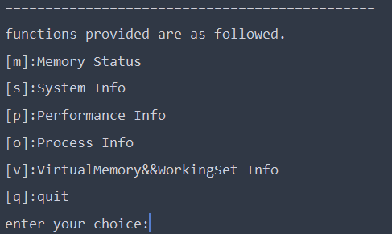
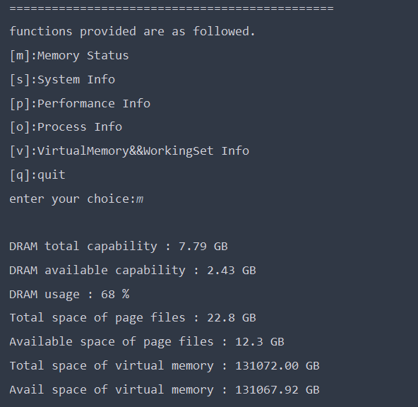
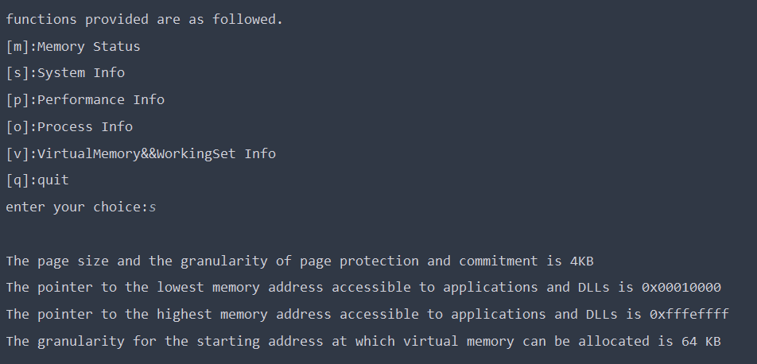
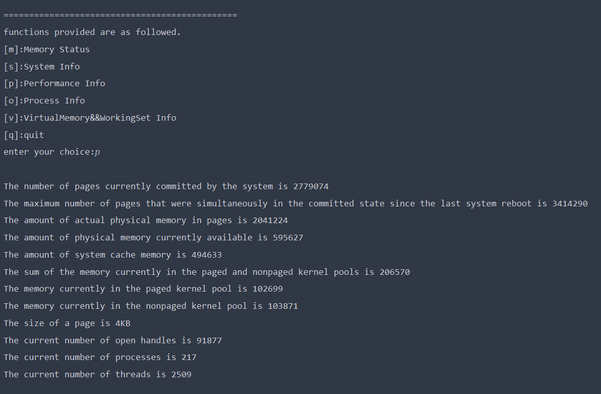
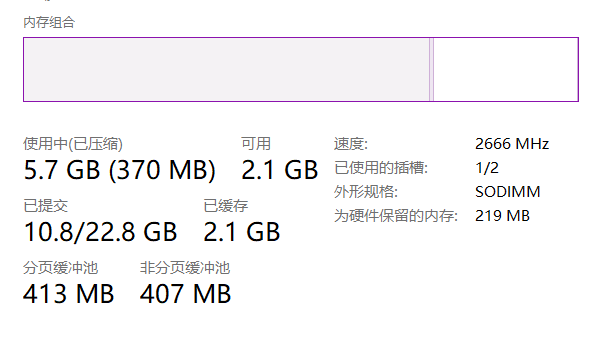
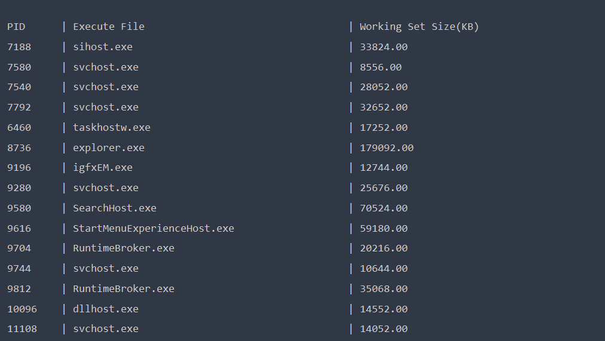
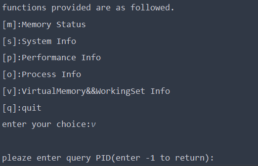
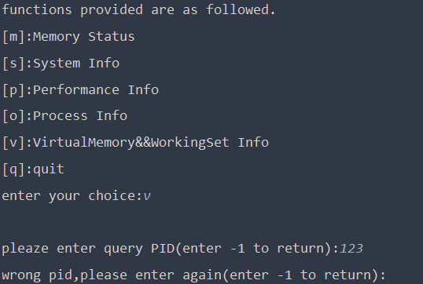
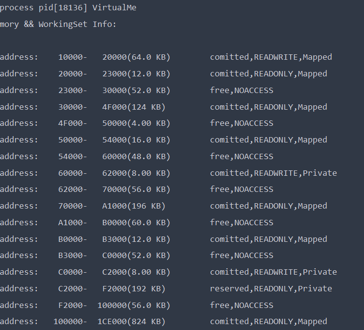
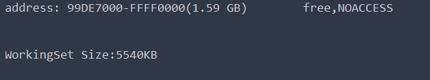

# **操作系统课程设计实验报告**

​                          

| **实验名称：** | 实验四 内存和进程地址空间实时显示 |
| -------------- | --------------------------------- |
| **姓名**       | 许哲源                            |
| **学号**       | 1120192079                        |

# 一.实验目的

熟悉Windows存储器管理中提供的各类机制和实现的请求调页技术。

通过实验，了解Windows内存结构和虚拟内存管理，学习如何在应用程序中管理内存。了解当前系统中内存的使用情况，包括系统地址空间的布局，物理内存的使用情况；能够实时显示某个进程的虚拟地址空间布局和工作集信息等

# 二.实验内容

设计一个内存监视器，能实时地显示当前系统中内存的使用情况，包括系统地址空间的布局，物理内存的使用情况；能实时显示某个进程的虚拟地址空间布局和工作集信息等。

相关的系统调用：  

* `GetSystemInfo`
* `VirtualQueryEx`
* `GetProcessMemoryInfo`
* `GetPerformanceInfo`
* `GlobalMemoryStatusEx `

# 三.实验环境

| 平台    | 环境                                               |
| ------- | -------------------------------------------------- |
| Windows | Windows 11 家庭中文版  ver21H2 ， Windows Terminal |

由于使用了动态链接库，编译时需链接动态库

### g++编译

```bash
g++ MemoryMonitor.cpp -lPsapi -lShlwapi -o MemoryMonitor.exe
```

### cmake编译

cmakelist：

```cmake
...
add_executable(mm MemoryMonitor.cpp)
target_link_libraries(mm Psapi)
target_link_libraries(mm Shlwapi)
...
```

cmake：

```bash
cmake --build [your/directory/here] --target mm -- -j 6
```

# 四.程序设计与实现

## 4.1实验原理

内存指的是计算机配置的RAM，系统可以管理所有的物理内存。操作系统（本实验特指Windows）通过分配RAM、页面文件或者二者中的空间，可以准确获取应用程序需要的内存

在Windows下运行的每个应用程序都认为能够独占4GB的虚拟地址空间，其中，低2GB为进程私有地址空间，用于存放程序和动态链接库，高2GB为所有进程共享区，也就是操作系统占用区。

事实上，少有进程可以占有2GB存储空间。Windows把每个进程的虚拟内存地址映射为物理内存地址。

## 4.2使用的数据结构

### 4.2.1内存状态结构体`MEMORYSTATUSEX`

Windows中使用`MEMORYSTATUSEX`结构体表示内存状态

该结构体包含了物理内存和虚拟内存的现有信息

#### 语法结构

```cpp
typedef struct _MEMORYSTATUSEX {
  DWORD     dwLength;
  DWORD     dwMemoryLoad;
  DWORDLONG ullTotalPhys;
  DWORDLONG ullAvailPhys;
  DWORDLONG ullTotalPageFile;
  DWORDLONG ullAvailPageFile;
  DWORDLONG ullTotalVirtual;
  DWORDLONG ullAvailVirtual;
  DWORDLONG ullAvailExtendedVirtual;
} MEMORYSTATUSEX, *LPMEMORYSTATUSEX;

```

#### 结构体成员说明

- `dwLength`：结构体大小，需要在调用`GlobalMemoryStatusEx`之前设定
- `dwMemoryLoad`：物理内存使用的百分比（从0到100）
- `ullTotalPhys`：实际物理内存的大小（单位：字节）
- `ullAvailPhys`：现在可用的物理内存大小（单位：字节）这部分物理内存是可以不需要写入磁盘立即被回收的内存。它是备用，空闲和零列表大小的综合
- `ullTotalPageFile`：系统或当前进程已经提交的内存限制中的较小者（单位：字节）。要获取系统范围的已提交内存限制需要调用`GetPerformanceInfo`
- `ullAvailPageFile`：当前进程可以提交的最大内存量（单位：字节）

* `ullTotalVirtual`：调用进程的虚拟地址空间的用户模式部分的大小（单位：字节）。此值取决于进程类型，处理机类型和操作系统配置，在x86处理器上多为2GB* 
* `ullAvailVirtual`：当前调用进程的虚拟地址空间的用户模式中未保留和未提交的内存量（单位：字节）
* `ullAvailExtendevVirtual`：保留值，始终为0
* 头文件：`sysinfoapi.h`（包括在`Windows.h`中）


### 4.2.2计算机系统信息结构体`SYSTEM_INFO`

Windows使用`SYSTEM_INFO`结构体保存当前计算机系统的信息，包括处理器的体系结构和类型，系统中处理器的数量，页面大小和其他信息

#### 语法结构

```cpp
typedef struct _SYSTEM_INFO {
  union {
    DWORD dwOemId;
    struct {
      WORD wProcessorArchitecture;
      WORD wReserved;
    } DUMMYSTRUCTNAME;
  } DUMMYUNIONNAME;
  DWORD     dwPageSize;
  LPVOID    lpMinimumApplicationAddress;
  LPVOID    lpMaximumApplicationAddress;
  DWORD_PTR dwActiveProcessorMask;
  DWORD     dwNumberOfProcessors;
  DWORD     dwProcessorType;
  DWORD     dwAllocationGranularity;
  WORD      wProcessorLevel;
  WORD      wProcessorRevision;
} SYSTEM_INFO, *LPSYSTEM_INFO;
```

#### 结构体成员说明

* `dwPageSize`：页面大小和页面保护和提交的粒度，是`VirtualAlloc`函数使用的页面大小

* `lpMinimumApplictionAddress`：指向应用程序和动态链接库（DLL）可访问的最低内存指针

  > 在本机上，显示应用程序和dll能访问的起始内存地址为0x10000
  >
  > **前64KB虚拟内存空间（0x00000-0x10000）为空指针赋值分区**
  >
  > * 为帮助程序员捕获对空指针的赋值，当线程试图读取或写入这一分区的内存地址，就会引发访问违规
  > * 没有任何办法可以让我们分配到位于这一地址区间的虚拟内存。

* `lpMaximumApplicationAddress`：指向应用程序和动态链接库（DLL）可访问的最高内存指针

  > 在本机上，显示应用程序和dll能访问的最高内存地址为0x7fffefff
  >
  > 有几点说明
  >
  > * 由于编译的程序为32位程序，因此程序可以访问的整个虚拟内存空间大小为4GB，这需要8位16进制数表出
  > * 0x7fffffff为前2g空间的最后一个地址，而windows将前2g空间划分给应用程序，后2g空间映射到系统内核程序与数据地址，2g/2g的划分方式也可以修改为3g/1g
  > * 0x7ffeffff-0x7fffffff这64kb空间为禁入区
  >   * windows系统禁止用户程序以任何方式访问这一段区域，防止因为在用户区写入过长的代码或者数据时，发生越界修改或者访问内核区内容

* `dwActiveProcessorMask`：配置到系统中的处理器集掩码

* `dwNumberOfProcessors`：当前组中的逻辑处理器数，若要检索，则需要调用`GetLogicalProcessorInformation`函数

* `dwAllocationGranularity`：可以分配虚拟内存的其实地址的粒度
  头文件：sysinfoapi.h（包含于Windows.h中）


### 4.2.3性能信息结构体`PERFORMANCE_INFORMATION`

Windows使用`PERFORMANCE_INFORMATION`结构体保存性能信息

#### 语法

```cpp
typedef struct _PERFORMANCE_INFORMATION {
  DWORD  cb;
  SIZE_T CommitTotal;
  SIZE_T CommitLimit;
  SIZE_T CommitPeak;
  SIZE_T PhysicalTotal;
  SIZE_T PhysicalAvailable;
  SIZE_T SystemCache;
  SIZE_T KernelTotal;
  SIZE_T KernelPaged;
  SIZE_T KernelNonpaged;
  SIZE_T PageSize;
  DWORD  HandleCount;
  DWORD  ProcessCount;
  DWORD  ThreadCount;
} PERFORMANCE_INFORMATION, *PPERFORMANCE_INFORMATION, PERFORMACE_INFORMATION, *PPERFORMACE_INFORMATION;
```

#### 结构体内容说明

- `cb`：结构体大小（单位：字节）

- `CommitTotal`：系统当前提交的页数，提交页面

  > 使用`VirtualAlloc`和`MEM_COMMIT`）会立即更新该值；但是在访问页面之前，物理内存不会被填充

- `CommitPeak`：自上次系统重新引导以来同时处于已提交状态的最大页数

- `PhysicalTotal`：实际物理内存，以页为单位

  > 该数值乘以页大小4KB，即得内存大小，本机为8GB

- `PhysicalAvailable`：当前可用的物理内存量，以页为单位。这部分内存是可以立即重用无需写入磁盘的内存，是备用，空闲和零列表大小的总和

- `SystemCache`：系统缓存内存量，以页为单位。该值为备用列表大小加上系统工作集

- `KernelTotal`：分页和非分页内核池中当前内存的总和，以页为单位

  > 在任务管理器中，也提供了分页和非分页内核池情况的显示

- `KernelPaged`：当前在分页内核池的内存，以页为单位

- `KernelNonpaged`：当前在非分页内核池中的内存，以页为单位

- `PageSize`：页面大小，以字节为单位

- `HandleCount`：当前打开手柄的数量

- `ProcessCount`：当前进程数

- `ThreadCount`：当前线程数

- 头文件：psapi.h

### 4.2.4进程列表条目

Windows使用`PROCESSENTRY32`结构体描述在拍摄快照时驻留在系统地址空间中的进程列表中的条目

#### 

#### 语法

```cpp
typedef struct tagPROCESSENTRY32 {
  DWORD     dwSize;
  DWORD     cntUsage;
  DWORD     th32ProcessID;
  ULONG_PTR th32DefaultHeapID;
  DWORD     th32ModuleID;
  DWORD     cntThreads;
  DWORD     th32ParentProcessID;
  LONG      pcPriClassBase;
  DWORD     dwFlags;
  CHAR      szExeFile[MAX_PATH];
} PROCESSENTRY32;
```

#### 结构体内容说明

- `dwSize`：结构体大小，以字节为单位。在调用`Process32First`函数之前要设置为`sizeof(PROCESSENTRY32)`，若没有设置，则函数调用会是失败
- `th32ProcessID`：进程标识符PID
- `cntThreads`：进程启动的线程数
- `th32ParentProcessID`：创建此进程的进程标识符，即父进程的PID
- `pcPriClassBase`：此进程创建的线程的基本优先级
- `szExeFile`：进程的可执行文件
- 其他成员：不再使用，始终设置为0
- 头文件：`tlhelp32.h`

### 4.2.5进程内存统计信息结构

Windows使用`PROCESS_MEMORY_COUNTERS`结构体保存进程的内存统计信息

#### 语法

```cpp
typedef struct _PROCESS_MEMORY_COUNTERS {
  DWORD  cb;
  DWORD  PageFaultCount;
  SIZE_T PeakWorkingSetSize;
  SIZE_T WorkingSetSize;
  SIZE_T QuotaPeakPagedPoolUsage;
  SIZE_T QuotaPagedPoolUsage;
  SIZE_T QuotaPeakNonPagedPoolUsage;
  SIZE_T QuotaNonPagedPoolUsage;
  SIZE_T PagefileUsage;
  SIZE_T PeakPagefileUsage;
} PROCESS_MEMORY_COUNTERS;
```

#### 结构体内容说明

- `cb`：结构体大小
- `PageFaultCount`：页面错误的数量
- `WorkingSetSize`：当前工作集大小（单位：字节）
- `PeakWorkingSetSize`：峰值工作集大小（单位：字节）
- `QuotaPeakPagedPoolUsage`：峰值分页池使用情况（单位：字节）
- `QuotaPagedPoolUsage`：当前页面缓冲池使用情况（单位：字节）
- `QuotaPeakNonPagedPoolUsage`：非页面缓冲池使用率的峰值（单位：字节）
- `QuotaNonPagedPoolUsage`：当前非分页池使用情况（单位：字节）
- `PagefileUsage`：此进程的Commit Charge值（单位：字节），Commit Charge是内存管理器为正在运行的进程提交的内存总量
- `PeakPagefileUsage`：此进程的生命周期内提交的峰值（单位：字节）
- 头文件：psapi.h

### 4.2.6虚拟地址空间信息

Windows使用`MEMORY_BASIC_INFORMATION`保存有关进程虚拟地址空间的一系列页面的信息，提供给`VirtualQuery`和`VirtualQueryEx`使用

#### 语法

```cpp
typedef struct _MEMORY_BASIC_INFORMATION {
  PVOID  BaseAddress;
  PVOID  AllocationBase;
  DWORD  AllocationProtect;
  SIZE_T RegionSize;
  DWORD  State;
  DWORD  Protect;
  DWORD  Type;
} MEMORY_BASIC_INFORMATION, *PMEMORY_BASIC_INFORMATION;
```

#### 结构体内容说明

- `BaseAddress`：指向页面区域的基址指针
- `AllocationBase`：指向`VirtualAlloc`函数分配的一系列页面的基址指针
- `AllocationProtect`：最初分配区域时的内存保护选项
- `RegionSize`：从基址开始的区域大小，其中所有页面都具有相同属性（单位：字节）
- `State`：页面的状态，可以是以下值：
  - `MEM_COMMIT`：表示已在内存中或磁盘页面文件中为其分配物理存储的已提交页面
  - `MEM_FREE`：表示调用进程无法访问且可以分配的空闲页面
  - `MEM_RESERVE`：表示保留进程的虚拟地址空间范围而不分配任何物理存储的保留页面
- `Protect`：该区域中页面的访问保护
- `Type`：页面的类型，可以是以下值：
  - `MEM_IMAGE`：指示区域内的内存页面映射到映射文件到视图中
  - `MEM_MAPPED`：指示区域内的内存页面映射到节的仕途
  - `MEM_PRIVATE`：指示区域内页面是私有的
- 头文件：winnt.h（包含于Windows.h中）


## 4.3实验使用的api

### 4.3.1检索内存使用情况的函数

Windows使用`GlobalMemoryStatusEx`函数检索有关系统物理和虚拟内存当前使用情况的信息

```cpp
BOOL GlobalMemoryStatusEx(LPMEMORYSTATUSEX lpBuffer);
```

- `lpBuffer`：指向`MEMORYSTATUSEX`结构的指针，该结构接受有关当前内存可用性的信息
- 返回值
  - 若函数成功，则返回值非零
  - 若函数失败，则返回值为0
- 头文件：`sysinfoapi.h`（包括在`Windows.h`中）
- DLL：`KERNEL32.DLL`

### 4.3.2获取系统信息函数

Windows使用`GetSystemInfo`函数获取当前系统的信息

```cpp
void GetSystemInfo(LPSYSTEM_INFO lpSystemInfo);
```

说明：

- `lpSystemInfo`：指向接受信息的`SYSTEM_INFO`结构体指针
- 头文件：`sysinfoapi.h`（包括在`Windows.h`中）
- DLL：`KERNEL32.DLL`

### 4.3.3获取性能函数

Windows使用`GetPerformanceInfo`函数获取性能信息，填充`PERFORMANCE_INFORMATION`结构中的性能值

```cpp
BOOL GetPerformanceInfo(
  PPERFORMANCE_INFORMATION pPerformanceInformation,
  DWORD cb
  );
```

- `pPerformanceInformation`：指向`PERFORMANCE_INFORMATION`结构的指针
- `cb`：`PERFORMANCE_INFORMATION`结构的大小，（单位：字节）
- 返回值：
  - 函数成功，则返回`TRUE`
  - 函数失败，则返回`FALSE`
- 头文件：`psapi.h`
- DLL：PSAPI_VERSION=1时，使用`Psapi.dll`，否则使用`Kernel32.dll`

### 4.3.4获取系统快照

Windows使用`CreateToolhelp32Snapshot`函数获取指定进程的快照，以及这些进程使用的堆、模块和线程

```cpp
HANDLE CreateToolhelp32Snapshot(
  DWORD dwFlags,
  DWORD th32ProcessID
);
```

- `dwFlags`：包含在快照中的系统部分，本实验选用的是`TH32CS_SNAPPROCESS`，表示包括快照中的所有进程，可以使用`Process32First`枚举这些进程
- `th32ProcessID`：要包含在快照中的进程的标识符，本实验该参数为0，指示当前进程
- 返回值：
  - 若函数成功，则返回快照句柄
  - 若函数失败，则返回`INVALID_HANDLE_VALUE`
- 头文件：`tlhelp32.h`
- DLL：`KERNEL32.DLL`

### 4.3.5获取系统快照中第一个进程
Windows使用`Process32First`函数获取有关系统快照中遇到的第一额进程的信息

```cpp
BOOL Process32First(
  HANDLE           hSnapshot,
  LPPROCESSENTRY32 lppe
);
```

- `hSnapshot`：从先前调用的`CreateToolhelp32Snapshot`函数返回的快照句柄
- `ppe`：指向`PROCESSENTRY32`结构的指针
- 返回值：若进程列表第一个条目已经复制到缓冲区，则返回`TRUE`，否则返回`FALSE`
- 注意：调用函数之前，必须将`PROCESSENTRY32`的`dwSize`设置为结构大小，否则会失败
- 头文件：`tlhelp32.h`
- DLL：`KERNEL32.DLL`

### 4.3.6获取快照中下一个进程
`Windows`使用`Process32Next`函数获取有关系统快照中记录的下一个进程的信息

```cpp
BOOL Process32Next(
  HANDLE           hSnapshot,
  LPPROCESSENTRY32 lppe
);
```

- `hSnapshot`：从先前调用的`CreateToolhelp32Snapshot`函数返回的快照句柄
- `lppe`：指向`PROCESSENTRY32`结构的指针
- 头文件：`tlhelp32.h`
- DLL：`KERNEL32.DLL`

### 4.3.7打开进程函数
Windows使用`OpenProcess`函数打开现有的本地进程对象

```
HANDLE OpenProcess(
  DWORD dwDesiredAccess,
  BOOL  bInheritHandle,
  DWORD dwProcessId
);
```

- `dwDesiredAccess`：对进程对象的访问权限
- `binheritHandle`：若此值为`TRUE`，则该进程创建的进程将继承该句柄。否则，子进程不会继承该句柄
- `dwProcessId`：要打开的本地进程的标识符，在实验中取PROCESSENTRY32结构中的`th32ProcessID`
- 返回值：
  - 若函数成功，则返回指定进程的打开句柄
  - 若函数失败，则返回NULL
- 头文件：`processthreadspai.h`（包含于`Windows.h`中）
- DLL：`KERNEL32.DLL`

### 4.3.8获取进程内存使用情况
Windows使用`GetProcessMemoryInfo`函数获取指定进程的内存使用情况的信息

```cpp
BOOL GetProcessMemoryInfo(
  HANDLE                   Process,
  PPROCESS_MEMORY_COUNTERS ppsmemCounters,
  DWORD                    cb
);
```

- `Process`：进程的句柄
- `ppsemCounters`：指向`PROCESS_MEMORY_COUNTERS`或`PROCESS_MEMORY_COUNTERS_EX`结构的指针
- `cb`：`ppsemCounters`结构大小
- 返回值：
  - 若函数成功，则返回值非零
  - 若函数失败，则返回值为零
- 头文件：`psapi.h`
- DLL：若PSAPI_VERSION=1，则使用`Psapi.dll`，否则使用`Kernel32.dll`

### 4.3.9显示页面保护
该段程序不是Windows提供的API，而是自己定义的若干函数（由教材提供）

```cpp
//显示保护标记,该标记表示允许应用程序对内存进行访问的类型,参考课本292页
inline bool TestSet(DWORD dwTarget, DWORD dwMask)
{
    return ((dwTarget & dwMask) == dwMask);
}

#define SHOWMASK(dwTarget, type)        \
	if (TestSet(dwTarget, PAGE_##type)) \
	{                                   \
		cout << "," << #type;           \
	}	

//显示当前块页面保护方式
void ShowProtection(DWORD dwTarget)
{
    //定义的页面保护方式
    SHOWMASK(dwTarget, READONLY);		   //只读
    SHOWMASK(dwTarget, GUARD);			   //保护
    SHOWMASK(dwTarget, NOCACHE);		   //无缓存
    SHOWMASK(dwTarget, READWRITE);		   //读写
    SHOWMASK(dwTarget, WRITECOPY);		   //写时复制
    SHOWMASK(dwTarget, EXECUTE);		   //执行
    SHOWMASK(dwTarget, EXECUTE_READ);	   //执行读
    SHOWMASK(dwTarget, EXECUTE_READWRITE); //执行读写
    SHOWMASK(dwTarget, EXECUTE_WRITECOPY); //执行写时复制
    SHOWMASK(dwTarget, NOACCESS);		   //未访问
}
```

## 4.4实验运行结果

程序初始化界面



可见有五个子功能供选择

### 4.4.1查询内存信息




> **页文件总大小与系统自带的项相符**
>
> 22.8GB总页面文件大小 = 实际内存7.78G + 虚拟分页文件15.36GB
>
> 

### 4.4.2查询系统信息



> 在本机上，显示应用程序和dll能访问的起始内存地址为0x10000
>
> **前64KB虚拟内存空间（0x00000-0x10000）为空指针赋值分区**
>
> * 为帮助程序员捕获对空指针的赋值，当线程试图读取或写入这一分区的内存地址，就会引发访问违规
> * 没有任何办法可以让我们分配到位于这一地址区间的虚拟内存。


> 在本机上，显示应用程序和dll能访问的最高内存地址为0x7fffefff
>
> 有几点说明
>
> * 由于编译的程序为32位程序，因此程序可以访问的整个虚拟内存空间大小为4GB，这需要8位16进制数表出
> * 0x7fffffff为前2g空间的最后一个地址，而windows将前2g空间划分给应用程序，后2g空间映射到系统内核程序与数据地址，2g/2g的划分方式也可以修改为3g/1g
> * **0x7ffeffff-0x7fffffff这64kb空间为禁入区**
>   * windows系统禁止用户程序以任何方式访问这一段区域，防止因为在用户区写入过长的代码或者数据时，发生越界修改或者访问内核区内容

### 4.4.3 查询性能信息



> 其中实际物理页数2041224乘以页面大小4KB，就能够得到实际的内存大小7.79GB
>
> 空闲物理页数595627乘以4KB，得到空闲的内存大小2.43GB
>
> 
>
> 分页非分页的缓冲池大小分别对应于paged pool的值102699乘以4KB，nonpaged pool的值103871乘以4KB

### 4.4.4查询运行进程



> 列出进程PID，可执行文件以及工作集的大小

### 4.4.5查询进程虚拟空间地址



需输入进程PID以完成查询

若输入-1，则程序返回

若输入的PID找不到进程，则返回错误提示并重新输入



输入正确的PID之后，打印相应的相对地址分块以及页面状态和权限的信息

 	

> 可见起始地址0x10000与前面的用户应用程序能访问的低位指针对应上，都是操作系统留了64KB的空指针区以便于分析程序中的空指针使用，用户程序无法访问

程序的最后打印出工作集的大小



# 五.实验收获与体会

1. 了解了windows系统内部内存的工作方式和工作情况
2. 对于本实验的所有数据结构和系统调用函数，在微软文档中进行阅读和深入理解，对于程序文档有了更深的理解与认识
3. 对操作系统内存分配方式有了进一步的印象。Windows把每个进程的虚拟内存地址映射到物理内存地址，操作系统通过页式管理的方式对内存进行管理