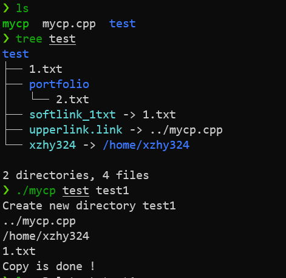
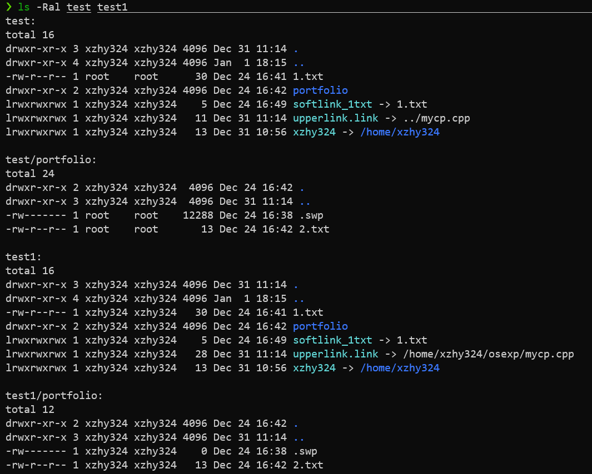
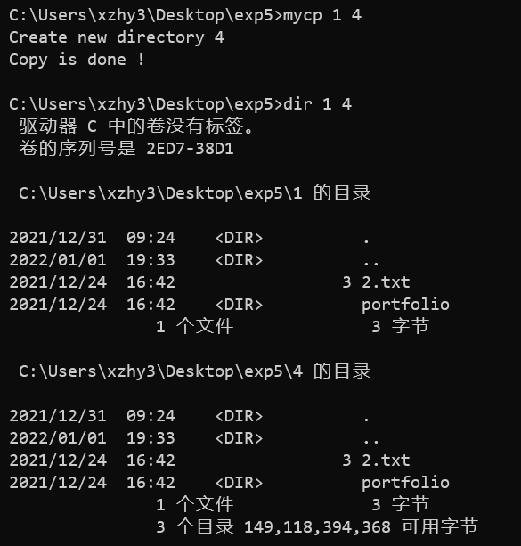

# **操作系统课程设计实验报告**

​                          

| **实验名称：** | 实验五 复制文件 |
| -------------- | --------------- |
| **姓名**       | 许哲源          |
| **学号**       | 1120192079      |

# 实验目的

了解在Windows中，文件系统如何管理保存在磁盘、光盘等存储介质上的信息。并通过文件系统提供的各种API，对文件进行同步和异步读写，深入了解Windows文件系统的功能和作用以及同步I/O和异步I/O的特点。

熟悉Linux文件系统提供的有关文件操作的系统调用。文件系统是使用计算机信息系统的重要接口。通过使用文件系统的系统调用命令操作文件，以达到对文件系统实现功能的理解和掌握。

完成一个目录复制命令mycp，包括目录下的文件和子目录

说明：Linux: creat，read，write等系统调用，要求支持软链接

Windows: CreateFile(), ReadFile(), WriteFile(), CloseHandle()等函数

特别注意复制后，不仅读写权限一致，而且时间属性也一致。


# 实验环境

| 平台    | 环境                                               |
| ------- | -------------------------------------------------- |
| Linux   | WSL2，Ubuntu20.04LTS kernel ver5.10 ，ZSH          |
| Windows | Windows 11 家庭中文版  ver21H2 ， Windows Terminal |

# 程序设计与实现

## 总体思路

1. 打开源目录

2. 采用DFS遍历源目录中的每一项

   * 如果是文件，就在目标目录的相应位置创建文件，然后复制文件内容

   * 如果是文件夹，在目标位置建立文件夹，然后递归地对该文件夹路径调用复制函数。
     * 在文件夹复制完成后才修改时间信息为一致

建立文件夹和文件的时候，

1. 源文件（夹）的权限复制到目标文件（夹）上去。
2. 源文件（夹）的时间信息复制到目标文件（夹）上去。
3. 对于linux，复制文件时要特别处理软链接，创建新的软连接直接指向源链接所指向的文件或目录
   * 若路径中包含`..`的相对路径，需要使用realpath()函数转化为绝对路径再创建软链接

## linux

### 使用的系统api

函数：

* ` lstat`：通过路径名获取文件相关信息
* `S_ISLNK`：判断当前所指向文件的类型
* ` creat`：创建文件并返回文件对象指针
* `read`：读文件
* `write`：写文件
* `utime`：改变文件的时间戳信息
* `lutimes`：改变文件的时间戳信息
  * `lutimes`不会对软链接文件进行解引用，而是改变软链接文件本身的时间戳信息
* `realpath`：将给出的绝对路径转化为相对路径
* `readlink` ：给出软链接对应的地址

结构体：

* `struct stat`：保存读取到的文件信息
* `struct timeval`：在lutimes中用于设置时间信息
* `struct utimbuf`：在utime中用于设置时间信息
* `struct dirent`：指向目录和文件的结构
* `DIR*`：指向目录的指针

### 程序流程

程序包含三个函数：

```cpp
//接受参数，判断参数合法性，调用mycp()函数
int main(int argc, char *argv[]);
//单文件复制函数，是mycp()的底层调用，实现源文件到目标文件的复制
void CopyFile(const char * *fsource*, const char * *ftarget*);
//目录复制函数，复制给定目录下的所有文件
void mycp(const char * fsource, const char * ftarget);
```

①、main()函数用来接受源目录和目标目录

```
int main(int argc,char *argv[])
{
   判断命令行输入参数的个数是否正确，若不正确进行相应的提示；
   若参数正确，则打开源文件，如果打开失败进行相应的提示；
   若上述两步都正确，保存源文件的信息，并以源文件的st_mode创建新目录；
   执行mycp操作；
   修改目标目录的访问时间和修改时间；
   执行完时进行相应的提示，并退出。

}
```

②、CopyFile()函数用来进行文件复制

```
void CopyFile(char *fsource, char *ftarget)
{
   以O_RDONLY的形式打开源文件，并返回文件描述符fd1，若fd1为-1表示打开失败进行相应的提示；
   将源文件的信息填入struct stat的结构体当中；
   以源文件的st_mode创建新文件，并返回文件描述符fd2，若fd2为-1表示创建文件失败进行相应的提示；
   判断源文件类型
    	若为软链接文件：
    		初始化相关参数；
    		读取真正路径；
    		若含相对路径：
    			转化为绝对路径；
    		创建软链接文件；
    		修改时间戳信息；
    		退出函数；
   读取源文件并返回读出的字节数，如果返回的字节数大于0，执行下面的操作：
		进行写入操作，写入时要传送的字节数为读取源文件时返回的字节数；
		如果写入操作的写入字节数不等于读取时读出的字节数，说明写入失败，进行相应的提示。
   修改写入文件的时间属性；
   关闭打开的文件。
}
```

③、mycp()函数用于将源目录文件复制到目标目录下

```
void mycp(char *fsource, char *ftarget)
{
   初始化相关变量；
   打开目录，返回指向DIR结构的指针；
   	while((entry= readdir(dir)) != NULL)//读目录
	{
   		if (entry->d_type == 4 && )//读到的是目录
   		{
   			修改参数；
   			stat(source,&statbuf);//统计source文件属性信息并放入statbuf中
   			mkdir(target,statbuf.st_mode);//创建目标目录
   			递归调用mycp()函数；
   			修改目标文件的访问和修改时间；
   			还原参数；
        }
		else//没有子目录，直接进行复制
		{
   			修改参数；
   			CopyFile()；//调用文件复制函数；
   			还原参数；
        }
   }
}
```

## windows

### 使用的系统api（文件操作部分）

`FindFirstFile`：查找指定文件路径的文件

`FindNextFile`：在`FindFirstFile`之后调用，展开同目录以及子目录下的所有文件

`CreateFile`：创建文件，成功返回文件指针

`ReadFile`：读文件

`WriteFile`：写文件

`SetFileTime`：改变文件时间戳信息

`GetFileAttributes`：获取文件属性信息

`SetFileAttributes`：设置文件属性信息

`CreateDirectory`：创建目录


### 程序流程

程序包含三个函数：

```cpp
//接受参数，判断参数合法性，调用mycp()函数
int main(int argc, char *argv[]);
//单文件复制函数，是mycp()的底层调用，实现源文件到目标文件的复制
void CopyFile(const char * *fsource*, const char * *ftarget*);
//目录复制函数，复制给定目录下的所有文件
void mycp(const char * fsource, const char * ftarget);
```

①、main()函数用来接受源目录和目标目录

```
int main(int argc,char *argv[])
{
   判断命令行输入参数的个数是否正确，若不正确进行相应的提示；

   若参数个数正确，则利用FindFirstFile()函数查找源文件
   如果查找源文件失败进行相应的提示；
   利用FindFirstFile()函数查找目标文件的路径
   若返回的句柄为INVALID_HANDLE_VALUE时，为目标文件创建目录；
   否则提示目标路径文件已存在

   执行mycp操作；

   执行完时进行相应的提示，并退出。

}
```

②、CopyFile()函数用来进行文件复制

```
void CopyFile(char *fsource, char *ftarget)
{
   定义变量；
   利用FindFirstFile()函数查找指向源文件路径的文件并将源文件的信息保存至WIN32_FIND_DATA结构体中，并返回相应的句柄；
   利用CreateFile()创建两个文件，分别为源文件和目标文件；
   利用WIN32_FIND_DATA结构体中的文件长度低32位减去文件长度的高32位，得到源文件的大小；
   从源文件中读取数据，并将数据写入新开的缓冲区中；
   将写入缓冲区中的数据写入到目标文件中；
   关闭相关的句柄。

}
```

③、mycp()函数用于将源目录信息复制到目标目录下

```
void mycp(char *fsource, char *ftarget)
{
   定义和初始化相关变量；
   利用FindFirstFile()函数查找指向源文件路径的文件并将源文件的信息保存至WIN32_FIND_DATA结构体中，并返回相应的句柄hfind；

   if(hfind != INVALID_HANDLE_VALUE)
{
   while (FindNextFile(hfind,&lpfindfiledata) != 0)//循环查找FindFirstFile()函数搜索后的下一个文件
   {
   	if(根据文件的属性得到是目录文件 && 该目录文件不是 . 或 ..)
   	{
   		初始化相关变量；
       	利用CreateDirecty()函数为目标文件创建目录；
        递归调用mycp()函数直到最底层为止；
        更新时间戳信息；
	}
    else(不是目录文件时)
    {
       拼接生成源文件和目标文件的路径
       CopyFile()；//调用文件复制函数；
       还原source和target；
    }
  }
```

# 实验结果

##  linux实验结果

源文件结构以及复制程序

​	


复制之后的详细信息展示：



可以看到

1. 多级目录能够正确复制
2. 时间和权限信息均相同
3. 指向相对路径（同级/上一级）以及指向绝对路径的符号链接均能够正确的被创建

## windows实验结果



可以看到

1. 多级目录能够正确复制
2. 时间信息相同

# 实验收获与体会

熟悉了windows和linux下文件管理系统api的调用。

在实验的过程中，遇到的问题是在linux的软链接拷贝时，一开始没有考虑路径中含有`..`的情况，导致拷贝之后出现错误，解决方案是使用realpath()先将相对路径转换成绝对路径，新的软链接直接指向目标软链接指向文件或文件夹的绝对路径。

